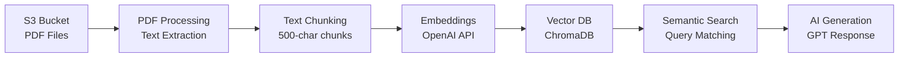

# RAG (Retrieval-Augmented Generation) System for PDF Documents

A demonstration of a production-ready RAG system that processes PDF documents from AWS S3, creates vector embeddings, and provides intelligent question-answering capabilities using OpenAI's models.

## 🎯 Overview

This system demonstrates how to build a **Retrieval-Augmented Generation (RAG)** pipeline that:
- Automatically discovers and processes PDF documents from S3
- Creates persistent vector embeddings for semantic search
- Provides intelligent answers by combining document retrieval with AI inference
- Scales efficiently with optimized chunking and batch processing

## 🏗️ Architecture

```
[S3 Bucket] → [PDF Processing] → [Text Chunking] → [Embeddings] → [Vector DB] → [Semantic Search] → [AI Generation]
     ↓              ↓                ↓              ↓             ↓              ↓                 ↓
  PDF Files    Text Extraction   500-char chunks  OpenAI API   ChromaDB    Query Matching    GPT Response
```
## AI Document Processing Pipeline


## 🔧 Key Components

### 1. **Document Discovery & Processing**
- **Auto-detection**: Scans S3 bucket for all PDF files automatically
- **Smart processing**: Only processes new documents, skips already embedded files
- **Text extraction**: Uses PyPDF2 for reliable PDF text extraction

### 2. **Intelligent Chunking**
- **Optimized size**: 500-character chunks with 100-character overlap
- **Boundary-aware**: Breaks at sentence/word boundaries for coherent chunks
- **Performance optimized**: Fast chunking algorithm prevents bottlenecks

### 3. **Vector Embeddings**
- **Modern model**: Uses OpenAI's `text-embedding-3-small` (faster, cheaper)
- **Batch processing**: Processes 20 chunks at once for efficiency
- **Persistent storage**: ChromaDB stores embeddings locally for reuse

### 4. **Semantic Search & Generation**
- **Similarity search**: Finds most relevant chunks using cosine similarity
- **Context synthesis**: Combines multiple chunks into coherent context
- **AI inference**: GPT-3.5-turbo generates natural language answers

## 📋 Prerequisites

1. **Python Environment**:
   ```bash
   python -m venv .venv
   source .venv/bin/activate  # On macOS/Linux
   pip install -r requirements.txt
   ```

2. **Required Packages**:
   ```
   boto3
   chromadb
   openai
   python-dotenv
   PyPDF2
   python-docx
   ```

3. **Environment Variables** (create `.env` file):
   ```bash
   # OpenAI API (Required)
   OPENAI_API_KEY=sk-proj-your-actual-api-key

   # AWS Configuration
   AWS_ACCESS_KEY_ID=your-access-key
   AWS_SECRET_ACCESS_KEY=your-secret-key
   AWS_DEFAULT_REGION=us-east-1

   # S3 Bucket
   S3_BUCKET_NAME=your-bucket-name
   ```

## 🚀 Usage

### Basic Usage
```bash
python rag_test_script.py
```

### First Run (Fresh Embedding)
```
🚀 Starting Simple RAG Demo with Persistence
📂 Created new persistent collection
📁 Scanning S3 bucket for all files...
📄 Found 3 PDF files in S3:
  📄 document1.pdf
  📄 document2.pdf  
  📄 document3.pdf
🔄 document1.pdf needs processing
🔄 Processing 238 chunks in batches of 20...
✅ Successfully processed and stored document1.pdf
```

### Subsequent Runs (Using Cached Embeddings)
```
🚀 Starting Simple RAG Demo with Persistence
📂 Found existing collection with 4635 chunks
✅ document1.pdf already processed (will skip)
✅ document2.pdf already processed (will skip)
✅ document3.pdf already processed (will skip)
🚀 Using existing embeddings from persistent storage
```

## 💡 Key Concepts Demonstrated

### 1. **Retrieval-Augmented Generation (RAG)**
- **Problem**: Large Language Models have limited knowledge cutoffs and can hallucinate
- **Solution**: Combine real-time document retrieval with LLM generation
- **Benefit**: Accurate, source-backed answers from your specific documents

### 2. **Vector Embeddings**
- **Concept**: Convert text into high-dimensional numerical vectors
- **Purpose**: Enable semantic similarity search (meaning-based, not keyword-based)
- **Example**: "AI security" and "artificial intelligence safety" have similar vectors

### 3. **Semantic Search**
- **Traditional**: Keyword matching ("red team" finds only exact matches)
- **Semantic**: Meaning-based search ("AI testing" finds "red teaming", "evaluation", "assessment")
- **Implementation**: Cosine similarity between query and document vectors

### 4. **Chunking Strategy**
- **Why needed**: Documents too large for model context windows
- **Approach**: Split into overlapping chunks to preserve context
- **Optimization**: Boundary-aware splitting maintains sentence coherence

### 5. **Persistence & Efficiency**
- **Problem**: Re-embedding documents is expensive and slow
- **Solution**: Persistent vector database stores embeddings locally
- **Smart processing**: Only processes new/changed documents

## 🔍 Query Examples

The system can answer questions like:

```python
# Research analysis
"What are the main research topics covered in these documents?"

# Specific concepts  
"What is red teaming in AI and why is it important?"

# Comparative analysis
"What methodologies or approaches are discussed?"

# Risk assessment
"Are there any risks or limitations mentioned in the research?"
```

## 📊 Performance Features

### Optimization Highlights
- **Batch embeddings**: 60-80% faster than individual requests
- **Smart chunking**: Prevents infinite loops and bottlenecks
- **Persistent storage**: Eliminates re-processing overhead
- **Progress tracking**: Real-time feedback on processing status

### Processing Stats Example
```
📄 Created 238 chunks from document.pdf
🔄 Processing 238 chunks in batches of 20...
  📊 Processing batch 1/12 (20 chunks)
  ✅ Batch 1 completed in 1.1s
✅ Total processing time: 9.6 seconds
```

## 🛠️ Advanced Features

### Automatic File Detection
- Scans entire S3 bucket for PDF files
- Detects new files automatically on each run
- Skips already processed documents

### Source Attribution
- Tracks which document each answer comes from
- Shows chunk distribution across sources
- Enables document-specific querying

### Error Handling
- Graceful handling of S3 connection issues
- Fallback mechanisms for API failures
- Comprehensive logging and progress indicators

## 🎨 Customizable Demo Questions

The system loads demo questions from `questions.txt`, making it easy to customize your demo without modifying code:

### **Question File Format**
```
What are the main research topics covered in these documents?
What is red teaming in AI and why is it important?
What are malicious uses of AI mentioned in the documents?
How can AI be disrupted or defended against attacks?
What security considerations are discussed for AI systems?
```

### **Easy Customization**
```bash
# Edit questions for your audience
nano questions.txt

# Add domain-specific questions
echo "What are the NIST AI security frameworks mentioned?" >> questions.txt

# Create audience-specific question sets
cp questions.txt business_questions.txt
cp questions.txt technical_questions.txt
```

### **Smart Fallbacks**
- Missing `questions.txt` → Uses built-in default questions
- Empty file → Loads fallback questions  
- File errors → Graceful degradation with basic questions

## 📁 File Structure

```
demarag/
├── rag_test_script.py      # Main RAG system
├── questions.txt           # Demo questions (easily customizable)
├── .env                    # Environment variables  
├── .venv/                  # Python virtual environment
├── chroma_db/              # Persistent vector database
├── scratch/                # Development/test files
└── README.md              # This documentation
```

## 🎬 Demo Flow

1. **Initial Setup**: Configure environment variables and S3 bucket
2. **Customize Questions**: Edit `questions.txt` for your audience/topic
3. **First Run**: Watch documents being processed and embedded
4. **Add New Document**: Upload a new PDF to S3
5. **Second Run**: See automatic detection and processing of only the new file
6. **Query Testing**: Ask questions from your customized question set
7. **Live Updates**: Modify questions in real-time for interactive demos

## 🔮 Extensibility

This system can be extended to:
- Support additional document formats (Word, text, HTML)
- Implement more sophisticated chunking strategies
- Add document metadata filtering
- Integrate with different vector databases
- Support streaming responses for large queries

## 💡 Key Takeaways

- **RAG bridges the gap** between static LLM training and dynamic document knowledge
- **Vector embeddings enable semantic understanding** beyond keyword matching
- **Persistence and optimization** make RAG systems production-ready
- **Source attribution** maintains transparency and trust
- **Automatic discovery** enables scalable document processing

This implementation demonstrates enterprise-ready RAG patterns with real-world optimizations for performance, reliability, and user experience.
